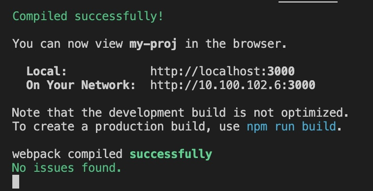

# My final Jhon Bryce project commerce app

**in order to set up the app you will also need to set up the front-end part of the project**
you can do that here: https://github.com/BakalMode/supermarket-back-JB-Final-Project

## Setting up instructaions: (without using docker)
                                                                                          
run this commad to install all the packedges:
- npm install

run this commad to start the server:
- npm start                                                                                                                  

if started correctly your terminal should have this prompt:                                                                              

and change the MY_SERVER to the ip of your back-end server:
MY_SERVER = "https//:yourserver.com:ddd"