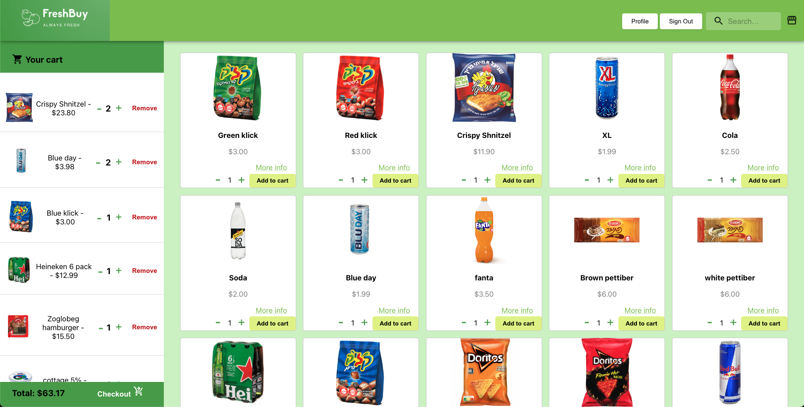
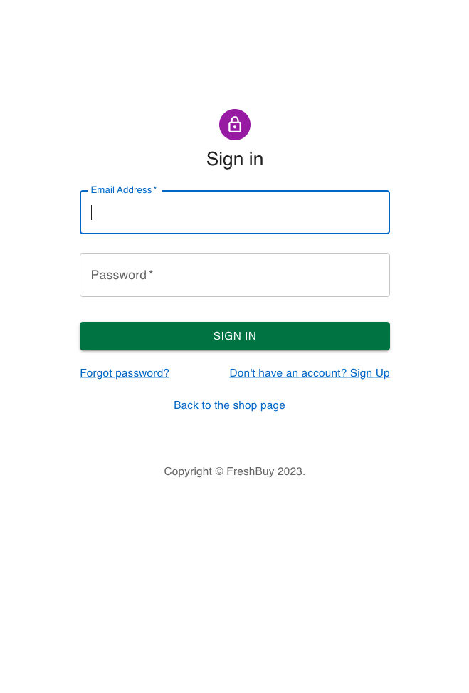
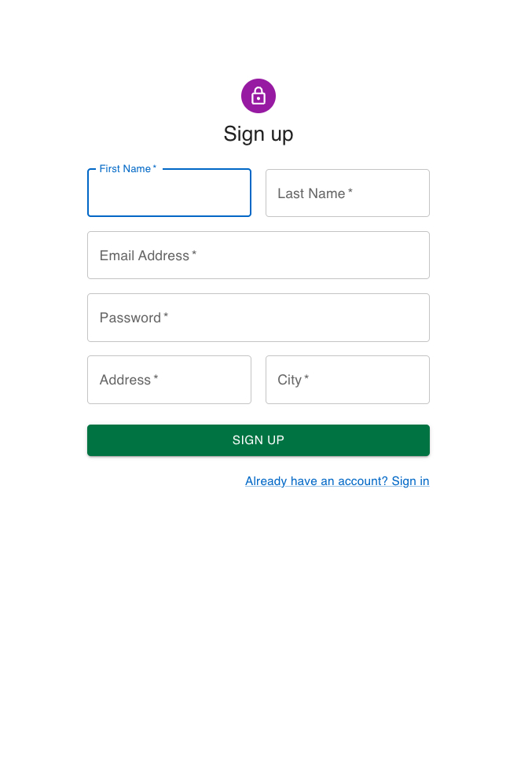
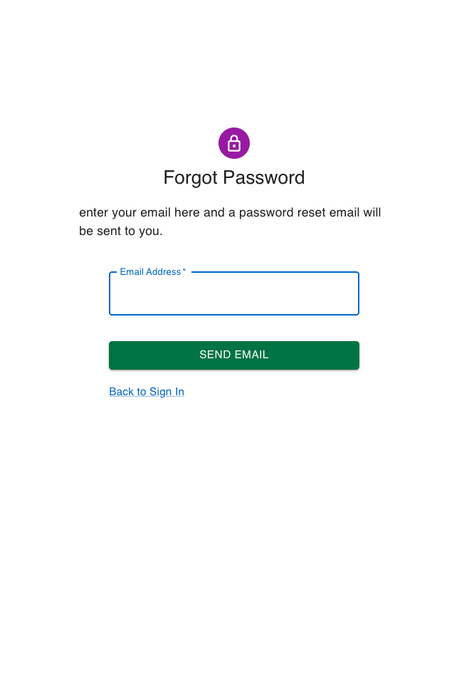
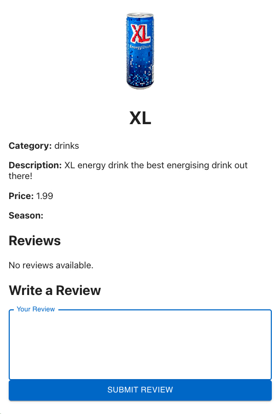
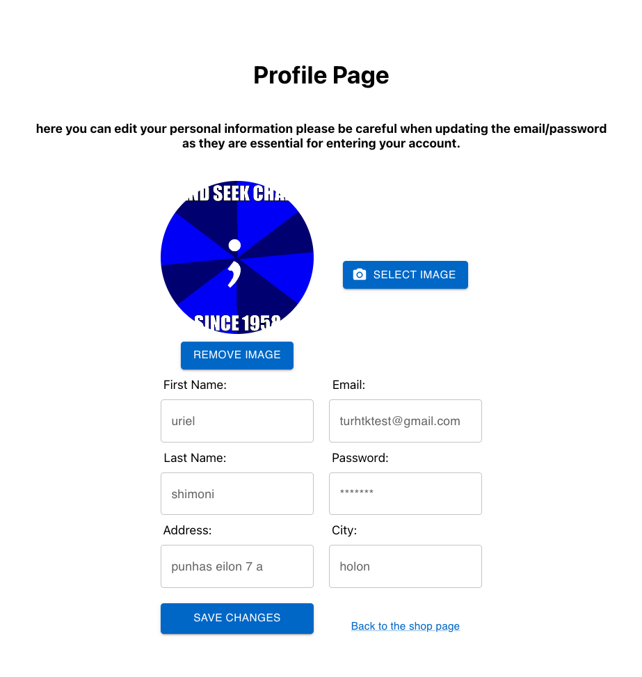
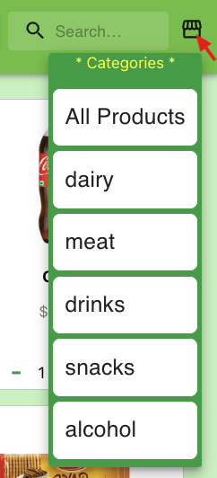
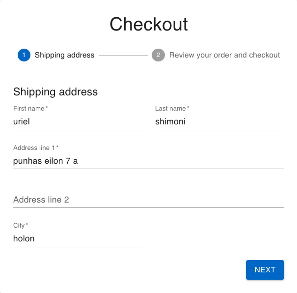
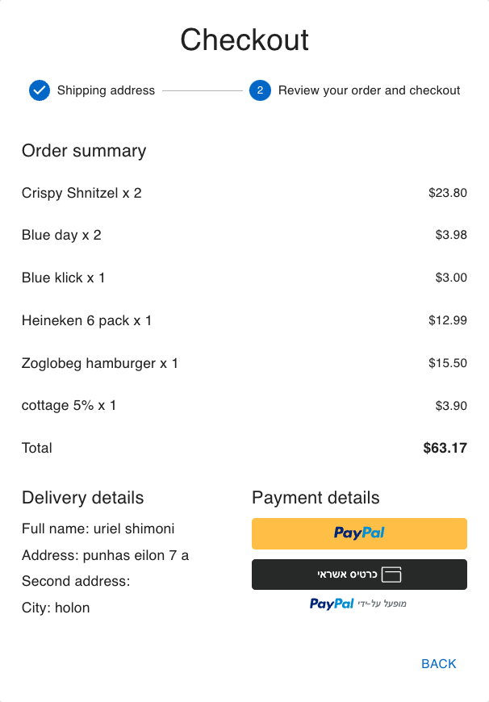
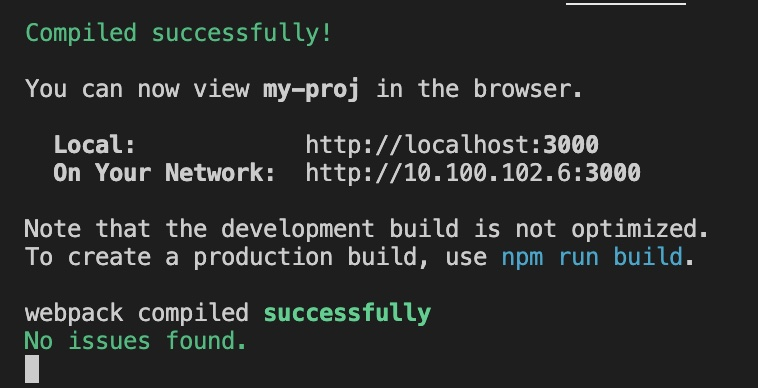

# FreshBuy

                                                                                                                               

**in order to set up the app you will also need to set up the front-end part of the project**
you can do that here: https://github.com/BakalMode/supermarket-back-JB-Final-Project

## What is included:

- A django admin panel for easy customazation:
 addind/removing products, removing accounts, creating more categories, and much more (at the backend link above)

- The FreshBuy app is your ultimate solution for effortless online shopping. Our user-friendly
 platform is designed with one soul purpose: to make your life easier.
  Experience the convenience of shopping from the comfort of your home with just a few taps.
  Enjoy a seamless and hassle-free shopping experience with Fresh, where simplicity meets efficiency.                             
 
## Features:

- Payment integration with Paypal and Credit card using Paypal Developer tools
- Email integration for password reset (works only with gmail) using EmailJS
- Ability to provide reviews on products you bought before if you are a registered user
- Products categories and a functioning search-bar for finding the product you want with ease
- A easy to use fully customizable profile page, were you can change your personal information 

## Screenshots

|                     Signin Page                    |                  Signup Page                          |                    ForgotPassword Page                |
| :---------------------------------------------------: | :---------------------------------------------------: | :---------------------------------------------------: |
|                    |                       |               |

|             Items Details Page                  |                Customer Profile Page               |                    Categories and Search-bar                     |
| :------------------------------------------------: | :------------------------------------------------: | :------------------------------------------------: |
|               |              |  |

|                 Checkout (customer info)     |                   Checkout (order info)        |
| :--------------------------------------------: | :--------------------------------------------: |
|            |              |

## Setting up instructaions: (without using docker)
                                                                                          
run this commad to install all the packedges:
-      npm install

run this commad to start the server:
-      npm start                                                                                                                  

if started correctly your terminal should have this prompt:                                                                              

and change the MY_SERVER to the ip of your back-end server:
-      MY_SERVER = "https//:yourserver.com:ddd"                                                                                                
**dont forget to set up the backend aswell**

## Technologies:

- [Django](https://www.djangoproject.com/) (at the back end part of the project)
- [Sqlite3](https://www.sqlite.org/about.html) (at the back end part of the project)
- [Python](https://www.python.org/about/) (at the back end part of the project)
- [ReactJS](https://react.dev/)
- [TypeScript](https://www.typescriptlang.org/)
- [ReactRedux](https://react-redux.js.org/)
- [MUI(Material-UI)](https://mui.com/about/) 
- [Docker](https://www.docker.com/company/)
- [EmailJS](https://www.emailjs.com/)
- [Paypal-Checkout](https://developer.paypal.com/home)
- [React-Router](https://reactrouter.com/en/main)

